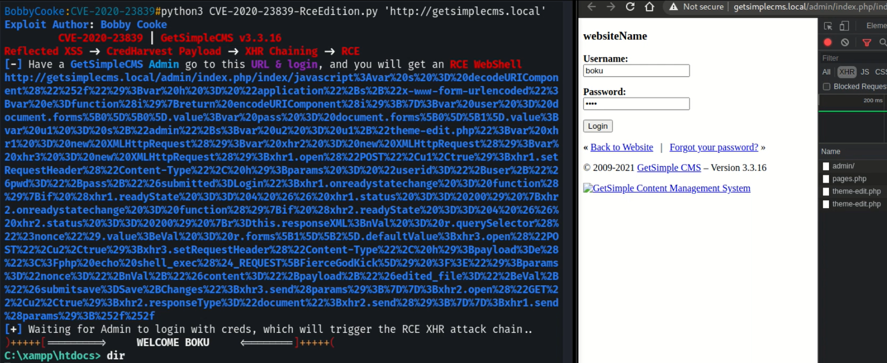

## CVE-2020-23839 | GetSimple CMS v3.3.16 - Reflected XSS to RCE
##### Exploit Author: Bobby Cooke (boku)

##### Vulnerability Statistics
+ OWASP Top Ten 2017: A7:2017-Cross-Site Scripting (XSS)
+ CWE-79: Improper Neutralization of Input During Web Page Generation ('Cross-site Scripting') - Type 1: Reflected XSS 
+ CVSS Base Score: 6.1 MEDIUM
+ CVSS v3.1 Vector: CVSS:3.1/AV:N/AC:L/PR:N/UI:R/S:C/C:L/I:L/A:N
+ https://nvd.nist.gov/vuln/detail/CVE-2020-23839
+ https://cve.mitre.org/cgi-bin/cvename.cgi?name=CVE-2020-23839

##### Vulnerability Analysis & Full Disclosure of Issue
+ https://github.com/GetSimpleCMS/GetSimpleCMS/issues/1330

##### Vulnerability Description:
+   GetSimple CMS v3.3.16 suffers from a Reflected XSS on the Admin Login Portal. On August 12th, 2020, the vendor received full disclosure details of the vulnerability via private email. The vulnerability was publicly disclosed on September 13th, 2020 via MITRE with the publication of CVE-2020-23839, which contained little details and no proof of concept. On January 20th, 2021 full disclosure and code analysis was publicly disclosed under the GetSimple CMS GitHub active issues ticket.
##### Exploit Description:
+   This exploit creates a Reflected XSS payload, in the form of a hyperlink,  which exploit CVE-2020-23839. When an Administrator of the GetSimple CMS system goes to this URL in their browser and enters their credentials, a sophisticated exploitation attack-chain will be launched, which will allow the remote attacker to gain Remote Code Execution of the server that hosts the GetSimple CMS system.
##### Attack Chain:
1. Attacker tricks GetSimple CMS Admin to go to the URL provided from this exploit
2. Admin then enters their credentials into the GetSimple CMS login portal
3. Reflected XSS Payload triggers onAction when the Admin clicks the Submit button or presses Enter
4. The XSS payload performs an XHR POST request in the background, which logs the browser into the GetSimple CMS Admin panel
5. The XSS payload then performs a 2nd XHR GET request to admin/edit-theme.php, and collects the CSRF Token & Configured theme for the webpages hosted on the CMS
6. The XSS payload then performs a 3rd XHR POST request to admin/edit-theme.php, which injects a PHP backdoor WebShell to all pages of the CMS
7. The exploit repeatedly attempts to connect to the public /index.php page of the target GetSimple CMS system until a WebShell is returned
8. When the exploit hooks to the WebShell, an interactive PHP WebShell appears in the attackers console

### Vendor Info
+ Vendor Homepage: http://get-simple.info/download/
